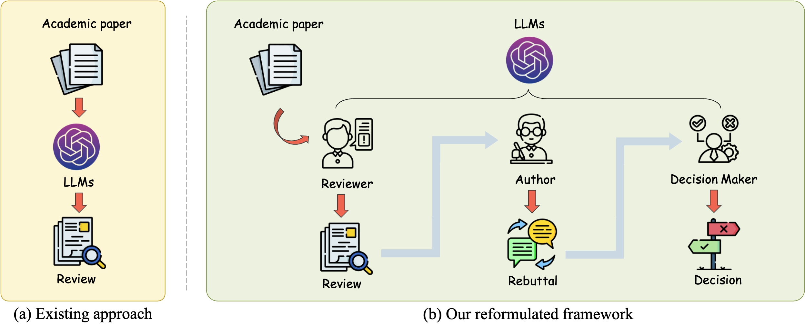
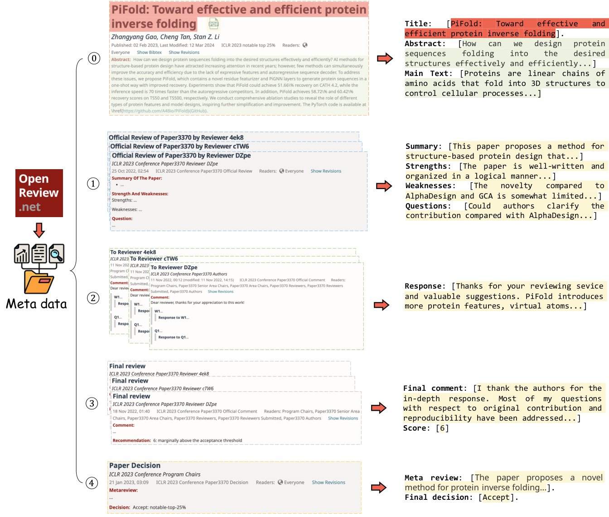
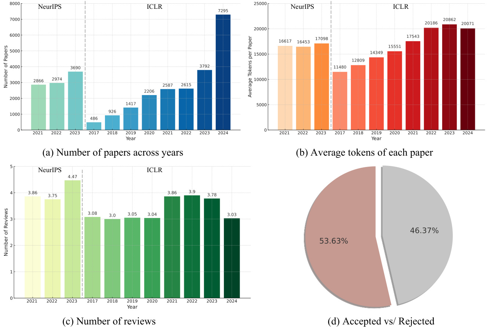

# ReviewMT

Large Language Models (LLMs) have demonstrated wide-ranging applications across various fields and have shown significant potential in the academic peer-review process. However, existing applications are primarily limited to static review generation based on submitted papers, failing to capture the dynamic and iterative nature of real-world peer reviews.

This project introduces **ReviewMT**, a framework that reformulates the peer-review process as a **multi-turn, role-specific, agent-based dialogue simulation**. We model the key participants – **Authors, Reviewers, and Area Chairs (Decision Makers)** – using distinct LLMs (or a single LLM prompted for specific roles) to simulate their interactions throughout the review lifecycle, including initial reviews, author rebuttals, reviewer discussions, and final decisions.

To facilitate this, we constructed **ReviewMT**, a comprehensive dataset containing over 26,841 papers with 92,017 review instances collected from the ICLR conference (OpenReview) and Nature Communications. This dataset is meticulously structured to train and evaluate LLMs in simulating multi-turn peer-review dialogues.

Furthermore, we propose and implement a suite of **role-specific metrics** to evaluate the performance of LLMs acting as Authors, Reviewers, and Area Chairs within this simulated environment, moving beyond simple text generation quality to assess functional correctness and interaction quality.

We believe this work provides a significant advancement in LLM-driven peer-review automation by embracing the dynamic, interactive, and role-based nature of the process. It offers a robust foundation and benchmark for developing and evaluating LLM agents capable of participating meaningfully in academic peer review.

**Datasets are available in the "Releases" section of this repository.**

**For more detailed explanations and examples, please refer to the `appendix.pdf` file.**

<p align="center" width="100%">
  
  <br>
</p>


---

**Table of Contents**

- [ReviewMT](#reviewmt)
- [Framework Overview](#framework-overview)
  - [Role-Specific Agents](#role-specific-agents)
  - [Multi-Turn Dialogue Simulation](#multi-turn-dialogue-simulation)
- [The ReviewMT Dataset](#the-reviewmt-dataset)
  - [Data Sources and Statistics](#data-sources-and-statistics)
  - [Data Processing Pipeline](#data-processing-pipeline)
- [Benchmark Results](#benchmark-results)
  - [Zero-Shot Performance](#zero-shot-performance)
  - [Fine-tuning Performance (ICLR Data)](#fine-tuning-performance-iclr-data)
  - [Fine-tuning Performance (Mixed Data)](#fine-tuning-performance-mixed-data)
  - [Role-Specific Evaluation (Example)](#role-specific-evaluation-example)
- [File Structure](#file-structure)
- [Installation](#installation)
- [How To Use](#how-to-use)
  - [1. Prepare Datasets](#1-prepare-datasets)
    - [Make the ReviewMT-ICLR dataset](#make-the-reviewmt-iclr-dataset)
    - [Make the ReviewMT-NC dataset](#make-the-reviewmt-nc-dataset)
    - [Prepare Mixed Dataset (Optional)](#prepare-mixed-dataset-optional)
  - [2. Fine-tune Models](#2-fine-tune-models)
    - [Model Fine-tuning Configuration Files](#model-fine-tuning-configuration-files)
    - [Steps for Fine-tuning](#steps-for-fine-tuning)
  - [3. Merge Adapters (Optional)](#3-merge-adapters-optional)
    - [Model Merge Configuration Files](#model-merge-configuration-files)
    - [Steps for Merging](#steps-for-merging)
  - [4. Run Inference & Simulation](#4-run-inference--simulation)
    - [Chat with Models via Llama Factory](#chat-with-models-via-llama-factory)
    - [Run Multi-Turn Simulation](#run-multi-turn-simulation)
    - [Export Dialogue File](#export-dialogue-file)
  - [5. Evaluate Performance](#5-evaluate-performance)
    - [Using the Evaluation Script](#using-the-evaluation-script)
- [Acknowledgement](#acknowledgement)
- [Citation](#citation)
- [Contact](#contact)

---

## Framework Overview

Our framework simulates the academic peer-review process by modeling the interactions between key roles as a multi-turn dialogue.

### Role-Specific Agents

We define three primary roles:

1.  **Author Agent:** Responsible for generating rebuttals based on reviewer comments and potentially revising the paper (revision generation is a potential future extension).
2.  **Reviewer Agent:** Responsible for generating initial reviews based on the paper abstract/content, and potentially engaging in discussion or revising reviews after rebuttal.
3.  **Area Chair (AC) / Decision Maker Agent:** Responsible for synthesizing reviews and rebuttals to make a final recommendation (e.g., Accept/Reject) and potentially providing a meta-review.

These roles can be instantiated using separate fine-tuned LLMs or a single powerful LLM guided by role-specific prompts.

### Multi-Turn Dialogue Simulation

The simulation captures the iterative nature of peer review:

1.  **Initial Review:** Reviewer Agents receive the paper (or abstract/selected sections) and generate initial reviews.
2.  **Rebuttal Phase:** The Author Agent receives the reviews and generates a rebuttal.
3.  **Discussion Phase (Optional):** Reviewer Agents can potentially see the rebuttal and other reviews to discuss or update their assessments.
4.  **Decision Phase:** The AC Agent receives all reviews and the rebuttal to generate a final decision and meta-review.

<p align="center" width="100%">
  
  <br>
  <em>Overview of the data processing pipeline for the ReviewMT dataset.</em>
</p>


---

## The ReviewMT Dataset

The **ReviewMT** dataset is the backbone of this project, providing real-world examples of peer-review dialogues.

### Data Sources and Statistics

The dataset combines data from two primary sources:

1.  **ICLR (2017-2024):** Sourced from OpenReview, containing papers (PDFs), reviews, meta-reviews, rebuttals, and decisions. This data provides rich multi-turn interactions.
2.  **Nature Communications (2023):** Sourced from publicly available review files, typically containing the paper, reviewer reports, author responses, and editorial decisions.

**Key Statistics:**

| Statistic              | Value        | Notes                                  |
| :--------------------- | :----------- | :------------------------------------- |
| Total Papers           | ~26,841+     | Combined from ICLR and NC              |
| Total Review Instances | ~92,017+     | Includes reviews, rebuttals, decisions |
| ICLR Range             | 2017 - 2024  | OpenReview data                        |
| NC Range               | 2023 (focus) | Public peer review reports             |
| Data Format            | JSON         | Structured dialogue format             |

<p align="center" width="100%">
  
  <br>
</p>


### Data Processing Pipeline

1.  **Data Crawling:** Scripts (`iclr_webcrawler.py`, `nature_webcrawler.py`) fetch raw data (PDFs, JSON metadata, review reports).
2.  **PDF to Markdown Conversion:** We utilize the `marker` tool ([VikParuchuri/marker](https://github.com/VikParuchuri/marker)) to convert paper and review PDFs into structured Markdown, significantly improving text extraction quality compared to standard PDF text extraction. This step is crucial for preserving layout and content integrity. (`iclr_convert.py`, `nature_convert.py`).
3.  **Dialogue Construction:** Scripts (`iclr_make.py`, `nature_make.py`) parse the Markdown/JSON data, identify roles (Author, Reviewer, AC), extract relevant text segments (reviews, rebuttals, decisions), and structure them into multi-turn dialogue JSON format suitable for LLM training. Regular expressions and heuristics are used, especially for parsing the less structured Nature Communications review reports. Unparseable files are logged (see `nature_make.yaml` options).
4.  **Dataset Splitting:** Data is typically split into training and testing sets (e.g., by year for ICLR, by month for NC, or randomly).

## File Structure

```bash
├── configs
│   ├── iclr_finetune/
│   ├── iclr_merge/
│   ├── nature_finetune/
│   ├── nature_merge/
│   └── mixed_finetune/dataset
│   └── mixed_merge/
├── data
│   ├── datasets
│   ├── iclr_test_data.json
│   ├── nature_test_data.json
│   └── raw_data
├── environment.yml
├── examples
│   ├── iclr_getrawdata.yaml
│   ├── iclr_convert.yaml
│   ├── iclr_make.yaml
│   ├── nature_getrawdata.yaml
│   ├── nature_convert.yaml
│   ├── nature_make.yaml
│   └── metric.yaml
├── prompts
│   └── role_prompts.json
├── README.md
├── requirements.txt
├── results
│   ├── simulation_output.json
│   └── evaluation_results/
├── scripts
│   ├── 1a_getRawData_iclr.sh
│   ├── 1b_getRawData_nature.sh
│   ├── 2a_convert_iclr.sh
│   ├── 2b_convert_nature.sh
│   ├── 3a_make_iclr.sh
│   ├── 3b_make_nature.sh
│   ├── 4a_finetune_example.sh
│   ├── 4b_inference_example.sh
│   └── 5_metric.sh
└── src
    ├── iclr_convert.py
    ├── iclr_make.py
    ├── nature_convert.py
    ├── nature_make.py
    ├── inference.py
    ├── metric.py
    ├── module.py
    ├── marker/
    └── webcrawlers/
        ├── iclr_webcrawler.py
        └── nature_webcrawler.py
```

## Installation

- **Environment:** We recommend using Conda.

  ```bash
  conda env create -f environment.yml
  conda activate reviewmt # Or your chosen environment name
  ```

- **Pip Requirements:** Install remaining packages.

  ```bash
  pip install -r requirements.txt
  ```

- **Marker Setup:** Ensure the `marker` submodule or code is correctly placed (e.g., in `src/marker`) and any specific dependencies it requires are met (like PyTorch matching its requirements). Refer to the official [marker documentation](https://github.com/VikParuchuri/marker) if needed.

  ```bash
  # If using as submodule, initialize and update
  git submodule update --init --recursive
  
  # Install marker's requirements
  cd src/marker
  pip install -r requirements.txt
  cd ../..
  ```

- **Llama Factory:** Installation is typically handled by `pip install llama-factory`. Ensure it's compatible with your environment. Refer to [Llama Factory documentation](https://github.com/hiyouga/LLaMA-Factory).

  ```bash
  pip install llama-factory
  ```
  
  If you encounter any issues with Llama Factory during fine-tuning or inference, please refer to their detailed [official documentation](https://github.com/hiyouga/LLaMA-Factory/blob/main/README.md) and [troubleshooting guides](https://github.com/hiyouga/LLaMA-Factory/issues).

- **Additional Tools:** For dataset operations, you may need additional tools like `jq` for JSON manipulation.

- **Environment Details:**

  -   Developed and tested with **PyTorch**: `2.0.1+` (ensure compatibility with `marker` and `llama-factory`)
  -   Developed and tested with **CUDA**: `11.8+`

---

## How To Use

Follow these steps to replicate the dataset creation, model fine-tuning, and evaluation. **All commands assume you are in the project's root directory.**

### 1. Prepare Datasets

Choose the dataset(s) you want to generate.

#### Make the ReviewMT-ICLR dataset

**Quick Start:**

```bash
bash scripts/1a_getRawData_iclr.sh
bash scripts/2a_convert_iclr.sh
bash scripts/3a_make_iclr.sh
```

**Custom Configuration:**

- Edit `examples/iclr_getrawdata.yaml` (specify years, paths, proxy).
- Edit `examples/iclr_convert.yaml` (specify paths, `marker` settings like `workers`, `min_length`). **Note:** Conversion is computationally intensive. Adjust `workers` based on your GPU/CPU resources.
- Edit `examples/iclr_make.yaml` (specify input/output paths).

#### Make the ReviewMT-NC dataset

**Quick Start:**

```bash
bash scripts/1b_getRawData_nature.sh
bash scripts/2b_convert_nature.sh
bash scripts/3b_make_nature.sh
```

**Custom Configuration:**

- Edit `examples/nature_getrawdata.yaml` (specify paths, proxy).
- Edit `examples/nature_convert.yaml` (specify paths, `marker` settings). Handles both paper and review PDFs.
- Edit `examples/nature_make.yaml` (specify paths, optional `train_month` for splitting, path for unrecognized files `inpath4`).

#### Prepare Mixed Dataset (Optional)

If you want to train on a combination of ICLR and NC data:

1. Generate both datasets individually as described above.

2. Manually combine the generated `train.json` and `test.json` (or equivalent) files from `data/datasets/iclr` and `data/datasets/nature`. Simple concatenation of the JSON arrays usually works.

   ```bash
   python -c "import json; open('data/datasets/mixed/train.json','w').write(json.dumps(json.load(open('data/datasets/iclr/train.json'))+json.load(open('data/datasets/nature/train.json'))))"
   python -c "import json; open('data/datasets/mixed/test.json','w').write(json.dumps(json.load(open('data/datasets/iclr/test.json'))+json.load(open('data/datasets/nature/test.json'))))"
   ```

3. Update the dataset paths in your fine-tuning configuration files (`configs/mixed_finetune/*.yaml`) to point to these combined files.

### 2. Fine-tune Models

We use **Llama Factory** for efficient fine-tuning (LoRA is recommended).

#### Model Fine-tuning Configuration Files

Configuration files for various models and datasets are provided in the `configs/` directory:

- `configs/iclr_finetune/`: For ICLR dataset.
- `configs/nature_finetune/`: For Nature Communications dataset.
- `configs/mixed_finetune/`: For the combined dataset.

Example: `configs/mixed_finetune/llama3_lora_sft_llama3.yaml`

**Key parameters to check/modify in YAML:**

- `model_name_or_path`: Base model identifier.
- `dataset`: Name of the dataset registered in Llama Factory (defined in `data_info.json`) or path(s) to your custom dataset files (e.g., `data/datasets/mixed/train.json`).
- `template`: Prompt template (e.g., `llama3`, `qwen`, `glm4`).
- `finetuning_type`: `lora` (recommended).
- `lora_target`: Modules to apply LoRA (e.g., `q_proj,v_proj` or `all`).
- `output_dir`: Where to save checkpoints and adapters.
- `per_device_train_batch_size`, `gradient_accumulation_steps`, `learning_rate`, `num_train_epochs`.
- `fp16` or `bf16`: Enable mixed-precision training.

#### Steps for Fine-tuning

1. **(Optional) Register Custom Dataset:** If using custom file paths not defined in Llama Factory's default `dataset_info.json`, you might need to point directly to the files in the YAML or update Llama Factory's dataset definitions.

2. **Run Training:**

   ```bash
   # Example using a config file for Llama-3 on the mixed dataset
   CUDA_VISIBLE_DEVICES=0,1 llamafactory-cli train configs/mixed_finetune/llama3_lora_sft_llama3.yaml
   ```

   - Adjust `CUDA_VISIBLE_DEVICES` based on your available GPUs.
   - Trained LoRA adapters will be saved in the `output_dir` specified in the YAML (e.g., `saves/Llama-3-8B-Instruct/lora/sft`).

### 3. Merge Adapters (Optional)

To get a standalone model with LoRA weights merged:

#### Model Merge Configuration Files

Located alongside finetuning configs (e.g., `configs/mixed_merge/`). These typically specify the base model, the adapter path, and the output path for the merged model.

#### Steps for Merging

1. **Run Export:**

   ```bash
   # Example merging Llama-3 adapters trained on mixed data
   CUDA_VISIBLE_DEVICES=0 llamafactory-cli export configs/mixed_merge/llama3_lora_sft_llama3.yaml
   ```

   - Ensure `adapter_name_or_path` points to your trained adapters.
   - Specify `export_dir` for the merged model output.
   - Set `export_quantization_bit` if you want to quantize during merge.

### 4. Run Inference & Simulation

#### Chat with Models via Llama Factory

Use Llama Factory's web UI or CLI for interactive testing:

```bash
# Example: Launch web UI for the fine-tuned Llama-3 model (merged or with adapter)
CUDA_VISIBLE_DEVICES=0 llamafactory-cli webchat configs/mixed_merge/llama3_lora_sft_llama3.yaml
# Or specify adapter path if not merged
# CUDA_VISIBLE_DEVICES=0 llamafactory-cli webchat --model_name_or_path meta-llama/Meta-Llama-3-8B-Instruct --adapter_name_or_path saves/Llama-3-8B-Instruct/lora/sft --template llama3
```

#### Run Multi-Turn Simulation

Use the provided `src/inference.py` script for simulating the review process.

```bash
python src/inference.py \
    --model_name_or_path /path/to/your/finetuned_or_merged_model \
    --adapter_path /path/to/lora/adapters \
    --test_file data/iclr_test_data.json \
    --output_file results/simulation_output.json \
    --role_prompts_file prompts/role_prompts.json \
    --max_new_tokens 1024
```

#### Export Dialogue File

The inference script should ideally output the simulated dialogues in a structured format (e.g., JSON) for evaluation.

### 5. Evaluate Performance

Use the `src/metric.py` script to calculate performance metrics based on the ground truth test data and the simulation output.

#### Using the Evaluation Script

**Custom Configuration:**

- Edit `examples/metric.yaml`:

  ```yaml
  ground_truth_file: data/iclr_test_data.json
  prediction_file: results/simulation_output.json
  output_dir: results/evaluation_results
  metrics:
    - hit_rate
    - review_quality_score
    - decision_accuracy
    - rebuttal_strength
  ```

**Run Evaluation:**

```bash
python src/metric.py --config examples/metric.yaml
```

The script will compare the model's generated outputs (reviews, rebuttals, decisions) against the ground truth data and report the specified metrics.

---

## Acknowledgement

This work leverages several open-source projects and datasets. We specifically thank:

-   The creators and maintainers of **OpenReview** for providing public access to ICLR review data.
-   The publishers of **Nature Communications** for making peer review reports publicly available.
-   The developers of the **LLaMA Factory** ([hiyouga/LLaMA-Factory](https://github.com/hiyouga/LLaMA-Factory)) for their excellent and user-friendly fine-tuning framework.
-   The creators of the **marker** tool ([VikParuchuri/marker](https://github.com/VikParuchuri/marker)) for high-quality PDF-to-Markdown conversion.
-   Hugging Face for the `transformers`, `datasets`, and model hub infrastructure.
-   The developers of the LLMs used in our experiments (Meta AI, Google AI, Zhipu AI, etc.).
